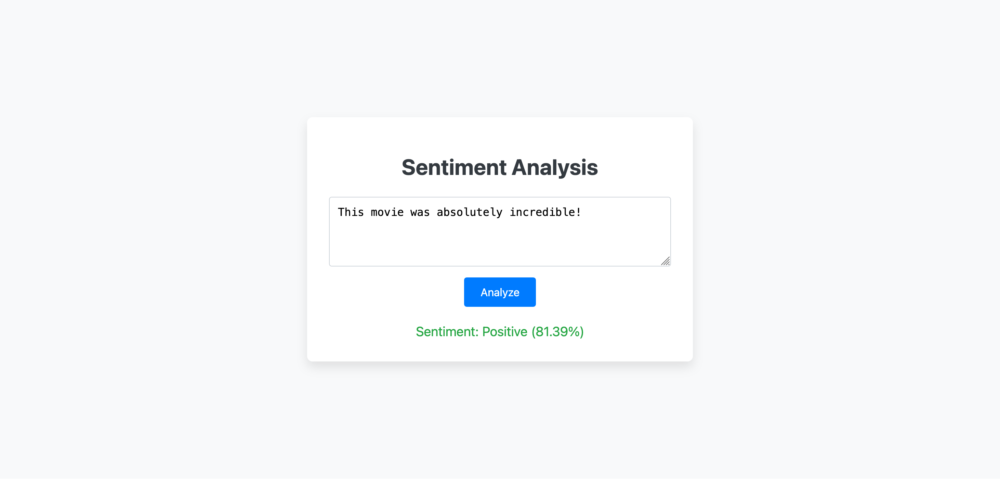
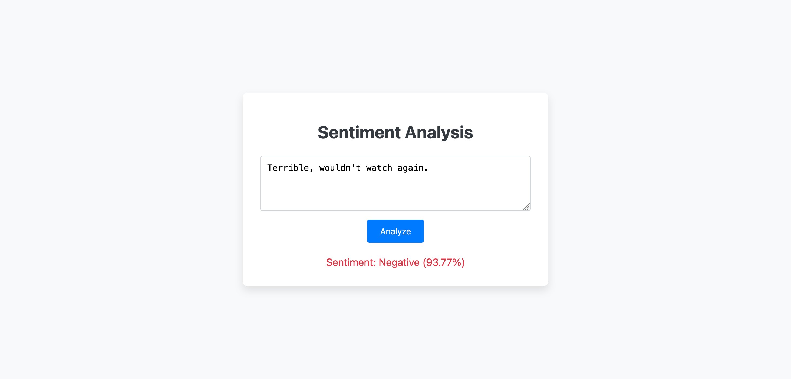

# Sentiment Analysis Web Application

**Live Demo:** [Link to Live Demo ](https://sentiment-cls-webpage-production.up.railway.app/)





## Project Description

This project is a simple web application that performs sentiment analysis on user-provided text. It features a lightweight Flask backend serving a static HTML frontend. The sentiment analysis is powered by a logistic regression model, chosen to optimize for fast API response times, prioritizing speed over the accuracy gains offered by more complex models like BERT. The frontend and API feature input validation and robust error handling.

The model was trained on the Large Movie Review Dataset from Stanford University. It achieves an accuracy of **89%+** on the official test set of 25,000 reviews.

## Technologies Used

- **Backend:** Python, Flask
- **Frontend:** HTML, CSS, JavaScript
- **Machine Learning:** scikit-learn (Logistic Regression, TfidfVectorizer)

## Why TF-IDF + Logistic Regression?

Though more complex models achieve higher accuracy, there are several reasons why I chose logistic regression instead:

1. **Speed**: Predictions in <200ms (API response time)
2. **Deployability**: Does not need GPUs to run
3. **Interpretability**: Can inspect feature weights to understand decisions
4. **Efficiency**: Small (<50MB) model with sufficient accuracy (89%) for this application

For a web application where we want a quick response time, this trade-off is worth it.

## Hyperparameter Tuning

A grid search was used to optimize parameters:

- **TF-IDF `max_features`**: Tested `[5000, 10000, None]` → `None` optimal
- **TF-IDF `ngram_range`**: Tested `[(1, 1), (1, 2)]` → `(1, 2)` optimal
- **TF-IDF `max_df`**: Tested `[0.8, 1.0]` → `0.8` optimal
- **TF-IDF `min_df`**: Tested `[0.05, 0.1, 1]` → `1` optimal
- **Logistic Regression `C` (Regularization Strength)**: Tested `[0.1, 1.0, 10.0]` → `10.0` optimal

## Setup and Installation

1.  **Clone the repository:**

    ```bash
    git clone https://github.com/charliebsulli/sentiment-cls-webpage.git
    cd sentiment-cls-webpage
    ```

2.  **Create and activate a virtual environment:**

    ```bash
    python -m venv .venv
    source .venv/bin/activate
    ```

3.  **Install dependencies:**

    ```bash
    pip install -r requirements.txt
    ```

4.  **Download the dataset (if you wish to retrain the model):**
    The model is pre-trained and included in `model.pkl` and `vectorizer.pkl`. If you want to retrain, download the ACLImdb dataset and place the `aclImdb` folder in the project root, then run `train.py`.
    [Download link for ACLImdb dataset](https://ai.stanford.edu/~amaas/data/sentiment/)

## Running the Application

Run the Flask application:

```bash
export FLASK_APP=app.py
flask run
```

- Open your web browser and navigate to `http://127.0.0.1:5000/` to access the sentiment analysis webpage.

## Project Structure

```
.
├── aclImdb/                # IMDb dataset (if downloaded)
├── templates/
│   └── index.html          # Frontend HTML, CSS, and JavaScript
├── .gitignore
├── app.py                  # Flask application (serves frontend and API)
├── data.py                 # Data loading utilities
├── grid_search.py          # Script for hyperparameter tuning
├── model.pkl               # Pre-trained Logistic Regression model
├── README.md               # Project README
├── requirements.txt        # Python dependencies
├── train.py                # Model training script
└── vectorizer.pkl          # Pre-trained TF-IDF vectorizer
```

## Dataset Citation

```
@InProceedings{maas-EtAl:2011:ACL-HLT2011,
  author    = {Maas, Andrew L.  and  Daly, Raymond E.  and  Pham, Peter T.  and  Huang, Dan  and  Ng, Andrew Y.  and  Potts, Christopher},
  title     = {Learning Word Vectors for Sentiment Analysis},
  booktitle = {Proceedings of the 49th Annual Meeting of the Association for Computational Linguistics: Human Language Technologies},
  month     = {June},
  year      = {2011},
  address   = {Portland, Oregon, USA},
  publisher = {Association for Computational Linguistics},
  pages     = {142--150},
  url       = {http://www.aclweb.org/anthology/P11-1015}
}
```
